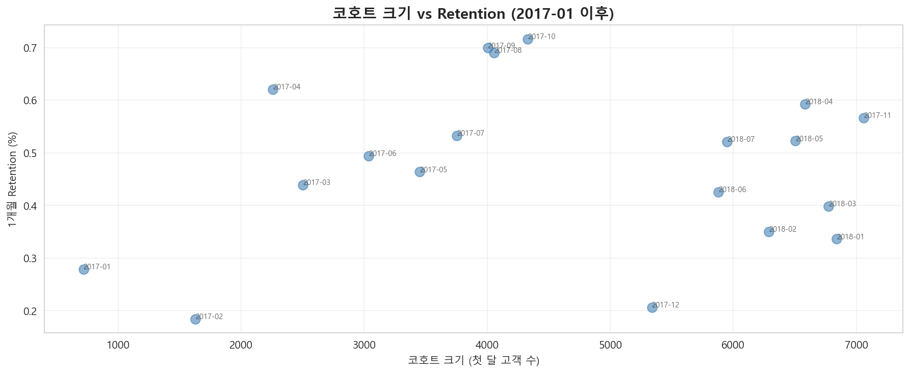
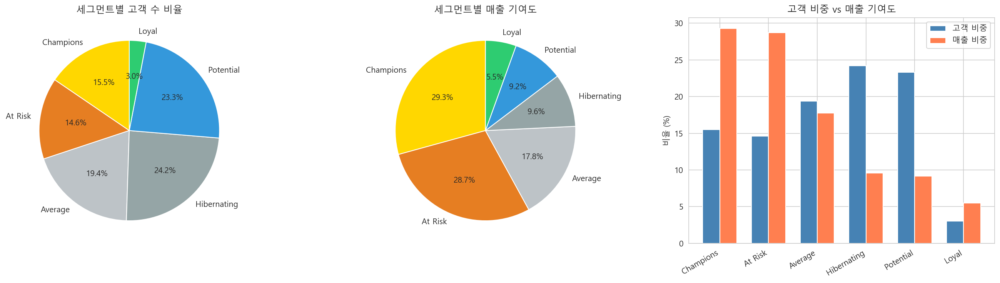
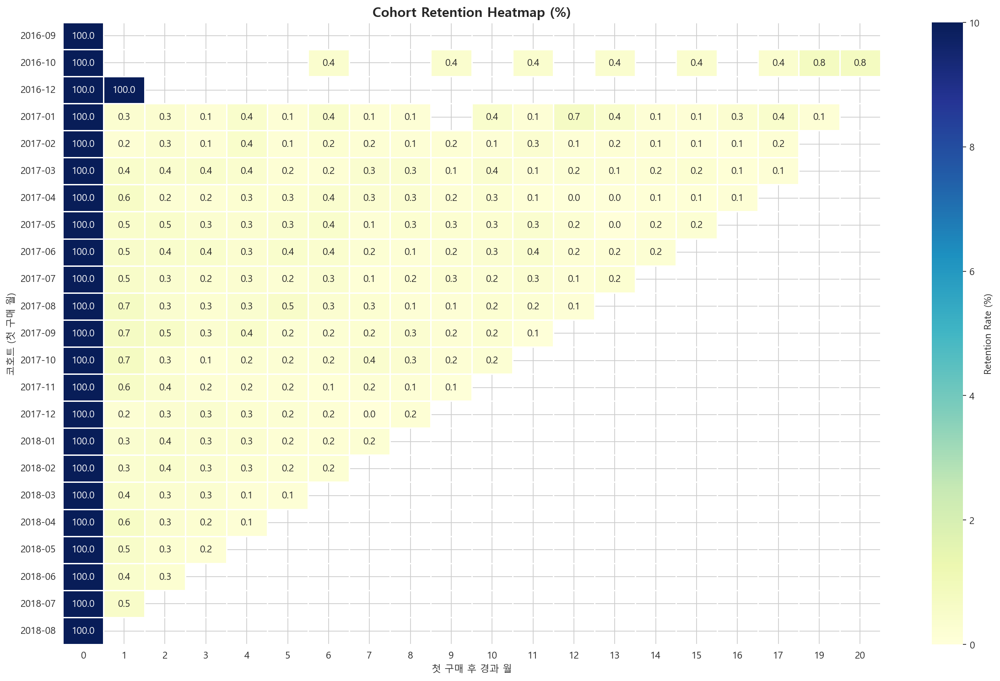

# 이커머스 고객 행동 분석

브라질 이커머스 플랫폼 Olist의 고객 행동을 RFM 세그먼테이션, K-means 클러스터링, 코호트 분석으로 다각도 분석한 개인 프로젝트입니다.

**개발 기간**: 2026.02

## ▶ 기술 스택

- 언어: Python 3.13
- 데이터: pandas, numpy
- 시각화: matplotlib, seaborn
- 모델링: scikit-learn (StandardScaler, KMeans, silhouette_score)

---

## ▶ 핵심 요약

이 프로젝트의 진짜 결과는 분석 기법의 적용이 아니라, **표준 분석 프레임워크를 데이터 분포에 맞춰 검증·재설계한 과정**입니다.

세 가지 핵심 발견:

1. **표준 RFM 8-segment가 작동하지 않는 데이터 특성 발견**  
   고객의 96%가 1회 구매에 그쳐 Frequency 점수가 분류력을 잃음. 데이터 분포에 맞춰 R/M 중심의 5-segment 체계로 재설계.

2. **규칙 기반 RFM과 K-means의 교차 검증으로 분류 안정성 입증**  
   핵심 세그먼트(Champions, Loyal)가 두 방법에서 100% 일치. At Risk 그룹은 K-means에서 두 갈래로 분리되어 추가 세분화 가능성 발견.

3. **코호트 크기-retention 상관관계의 이상치 민감도 검증**  
   전체 데이터에서 음의 상관(r=-0.472, p=0.036)이 관찰되었으나, 초기 소규모 코호트(2016-12, 1명) 제외 시 상관관계 소멸(r=0.115, p=0.640). 소규모 표본에서 이상치 하나가 통계적 결론을 완전히 뒤집을 수 있음을 보여주는 사례.



---

## ▶ 핵심 인사이트

1. **표준 프레임워크는 시작점일 뿐** — RFM 8-segment는 교과서 기본이지만, F=1이 96%인 데이터에서는 분류력을 잃음. 데이터 분포 점검 없이 표준을 그대로 쓰면 의미 없는 세그먼트가 양산됨.

2. **두 가지 방법이 같은 결론을 낼 때 분류는 신뢰할 수 있다** — RFM(규칙 기반)과 K-means(거리 기반)는 완전히 다른 원리지만 핵심 세그먼트(Champions, Loyal)에서 100% 일치. 이는 해당 라벨이 데이터 구조에 내재된 자연스러운 군집임을 시사.

3. **소표본에서는 p-value를 신뢰하기 전에 이상치를 의심하라** — n=20에서 p=0.036의 통계적 유의성도 코호트 1개로 뒤집힘. 통계적 유의성 ≠ 실질적 유의성.

4. **고객의 96%가 1회 구매라는 사실은 비즈니스 시사점** — 1개월 retention 5.45% → 3개월 0.25%의 절벽 패턴과 결합해 보면, Olist는 "재구매를 만들지 못하는 구조"를 점검할 필요. 신규 획득보다 재구매 전환이 더 큰 레버.

---

## ▶ 분석 흐름

### 1. 데이터 탐색 및 품질 검증 (`1_data_exploration.ipynb`)
- 9개 테이블 로드 및 관계 파악
- 결측치를 단순 제거가 아닌 비즈니스 의미 기준으로 해석
- 가격 이상치 IQR 검증, 시간 무결성 확인
- 분석용 통합 데이터셋 구성

### 2. RFM 세그먼테이션 (`2_rfm_analysis.ipynb`)
- Recency, Frequency, Monetary 지표 계산 및 분위수 점수화
- 표준 8-segment 프레임워크의 한계 확인 (F=1이 96%)
- R/M 중심의 5-segment 체계로 재설계 (Champions / Loyal / Potential / At Risk / Hibernating / Average)
- 세그먼트별 매출 기여도 및 매출/고객 비율 분석

### 3. K-means 클러스터링 (`3_kmeans_clustering.ipynb`)
- StandardScaler + log 변환으로 RFM 표준화
- Elbow method와 Silhouette score로 최적 k 평가
- k=4 클러스터링 적용 후 비즈니스 의미 부여
- 규칙 기반 RFM 세그먼트와 교차 분석으로 분류 안정성 검증

### 4. 코호트 분석 (`4_cohort_analysis.ipynb`)
- 첫 구매 월 기준 코호트 정의
- Retention 매트릭스 및 히트맵 시각화
- 코호트별 retention curve 비교
- 코호트 크기와 retention의 상관관계 분석

---

## ▶ 주요 결과

### RFM 세그먼트 분포



| 세그먼트 | 고객 수 | 비율 |
|---|---:|---:|
| Champions | 14,452 | 15.48% |
| Loyal | 2,801 | 3.00% |
| Potential | 21,772 | 23.32% |
| At Risk | 13,646 | 14.62% |
| Average | 18,105 | 19.39% |
| Hibernating | 22,582 | 24.19% |

### K-means 클러스터링 결과 (k=4)

| 클러스터 | 특성 | 고객 비중 | 매출 비중 |
|---|---|---:|---:|
| Cluster 1 | 최근 고액 구매자 | 34.7% | 61.5% |
| Cluster 2 | 휴면 고객 | 29.1% | 22.6% |
| Cluster 0 | 최근 저액 구매자 | 33.2% | 10.4% |
| Cluster 3 | 충성 재구매 고객 | 3.0% | 5.5% |

### RFM × K-means 교차 분석

규칙 기반 분류와 K-means가 핵심 세그먼트에서 높은 일치율을 보임:

- Champions로 분류된 고객 14,452명 **전원이 K-means Cluster 1**에 속함
- Loyal로 분류된 고객 2,801명 **전원이 Cluster 3**에 속함
- Hibernating으로 분류된 고객의 **80.9%가 Cluster 2**에 속함

At Risk 그룹은 K-means에서 두 갈래로 분리됨 (Cluster 1: 36% / Cluster 2: 64%) — 동일 라벨 내에서도 매출 가치가 이질적임을 시사.

### 코호트 retention



| 시점 | Retention |
|---|---:|
| 1개월 후 | 5.45% |
| 3개월 후 | 0.25% |
| 12개월 후 | 0.21% |

1개월 retention이 그 이후 대비 약 20배 높음. 재구매 의사결정이 사실상 첫 달 안에 결정됨.

### 코호트 크기와 retention: 이상치 민감도 검증

| 조건 | n | Pearson r | p-value | 해석 |
|------|---|-----------|---------|------|
| 전체 코호트 | 20 | -0.472 | 0.036 | 유의 (α=0.05) |
| 2016년 초기 코호트 제외 | 17 | 0.115 | 0.640 | 유의하지 않음 |

전체 데이터에서 관찰된 음의 상관은 2016-12 코호트(1명, retention 100%)에 의한 착시.
이상치 제외 시 상관관계 소멸. 본 데이터에서 "코호트가 클수록 retention이 낮다"는 가설은 지지되지 않음.

---

## ▶ 가설 vs 실제 결과

| 항목 | 사전 가설 | 실제 결과 |
|---|---|---|
| 표준 RFM 8-segment | 적용 가능 | F=1 비중이 96%라 분류력 상실, 재설계 필요 |
| K-means vs 규칙 분류 | 차이가 클 것 | 핵심 세그먼트 100% 일치, 분류 체계 안정성 확인 |
| Retention 곡선 | 점진적 감소 | 1개월에 급격히 감소 후 거의 0에 수렴 |
| 코호트 규모 효과 | 무관할 것 | 전체 데이터에서 음의 상관(r=-0.47) 발견 → 이상치 제외 시 소멸(r=0.12). 가설대로 무관 |

---

## ▶ 한계점

- 외국 이커머스 데이터(브라질)로 한국 시장과 직접 비교 불가
- 분석 기간 2년으로 12개월 이상 retention은 일부 코호트만 관측
- 2016년 9~12월 초기 코호트는 표본이 매우 작아 통계적 의미 제한
- 외부 변수(마케팅 캠페인, 프로모션 시점) 미반영
- 카테고리/지역별 세분화 분석은 향후 과제

---

## ▶ 향후 개선 방향

- 카테고리별 RFM 세분화 (어떤 카테고리에서 retention이 높은가)
- 지역(state)별 고객 행동 차이 분석
- 결제 방식(credit_card vs boleto)과 retention의 관계
- CLV(Customer Lifetime Value) 모델링으로 세그먼트별 미래 가치 예측

---

## ▶ 파일 구조

```
ecommerce-analysis/
├── notebooks/
│   ├── 1_data_exploration.ipynb     # 데이터 탐색 및 품질 검증
│   ├── 2_rfm_analysis.ipynb         # RFM 세그먼테이션
│   ├── 3_kmeans_clustering.ipynb    # K-means 클러스터링
│   └── 4_cohort_analysis.ipynb      # 코호트 분석
├── data/                            # Kaggle 데이터 (gitignore)
├── .gitignore
└── README.md
```

---

## ▶ 사용 데이터

| 데이터 | 출처 | 규모 |
|---|---|---|
| Brazilian E-Commerce Public Dataset | [Kaggle (Olist)](https://www.kaggle.com/datasets/olistbr/brazilian-ecommerce) | 9개 테이블, 약 10만 건 주문 |
| 분석 기간 | 2016.09 ~ 2018.10 | 약 2년 |
| 분석 대상 | 배송 완료 주문 | 96,478건, 93,358명 |